## Doxygen文档生成工具


### 简介

Doxygen可以在我们写代码的时候讲注释转化为说明书，Graphviz主要是用于图形展示，html help workshop主要使用生成CHM文档。
**1.Doxygen**

Doxygen能将程序中的特定批注转换成为说明文件。它可以依据程序本身的结构，将程序中按规范注释的批注经过处理生成一个纯粹的参考手册，通过提取代码结构或借助自动生成的包含依赖图（include dependency graphs）、继承图（inheritance diagram）以及协作图（collaboration diagram）来可视化文档之间的关系， Doxygen生成的帮助文档的格式可以是CHM、RTF、PostScript、PDF、HTML等。

**2.graphviz**

Graphviz(Graph Visualization Software)是一个由AT&T实验室启动的开源工具包,用于绘制DOT语言脚本描述的图形。要使用Doxygen生成依赖图、继承图以及协作图，必须先安装graphviz软件。

**3.HTML Help WorkShop**

微软出品的HTML Help WorkShop是制作CHM文件的最佳工具，它能将HTML文件编译生成CHM文档。Doxygen软件默认生成HTML文件或Latex文件，我们要通过HTML生成CHM文档，需要先安装HTML Help WorkShop软件，并在Doxygen中进行关联。

**4.vscode 插件**

Doxygen Documentation Generator 格式代码， Doxygen Previewer 单文件预览，Doxygen 格式高亮

#### 自动链接

[Automatic link generation](https://www.doxygen.nl/manual/autolink.html)

doxygen可以自动链接 网页，文件，类，函数，成员，typedefs，具体细节参见链接。

### 注释规则

#### 单行注释

```
/// ... text ...
```

```
//! ... text ...
```

#### 块注释

JavaDoc类型：

```
/**
 * ... text ...
 */
```

Qt类型：

```
 /*!
 * ... text ...
 */
```

```
/*!
 ... text ...
*/
```

多个单行注释：

```
///
/// ... text ...
///
```

```
//!
//!... text ...
//!
```

```
/////////////////////////////////////////////////
/// ... text ...
/////////////////////////////////////////////////
```

```
/************************************************
 *  ... text
 ***********************************************/
```


注意以下几点：

> 1. Doxygen并不处理所有的注释，doxygen重点关注与程序结构有关的注释，比如：文件、类、结构、函数、全局变量、宏等注释，而忽略函数内局部变量、代码等的注释。
> 2. 注释应写在对应的函数或变量前面。JavaDoc风格下，自动会把第一个句号"."前的文本作为简要注释，后面的为详细注释。你也可以用空行把简要注释和详细注释分开。注意要设置JAVADOC_AUTOBRIEF或者QT_AUTOBRIEF设为YES。
> 3. 先从文件开始注释，然后是所在文件的全局函数、结构体、枚举变量、命名空间→命名空间中的类→成员函数和成员变量。
> 4. Doxygen无法为DLL中定义的类导出文档。

#### 常用指令

|            |                                                              |
| ---------- | ------------------------------------------------------------ |
| @file      | 档案的批注说明。                                             |
| @author    | 作者的信息                                                   |
| @brief     | 用于class 或function的批注中，后面为class 或function的简易说明。 |
| @param     | 格式为@param arg_name 参数说明主要用于函式说明中，后面接参数的名字，然后再接关于该参数的说明。 |
| @return    | 后面接函数传回值的说明。用于function的批注中。说明该函数的传回值。 |
| @retval    | 格式为@retval value 传回值说明主要用于函式说明中，说明特定传回值的意义。所以后面要先接一个传回值。然后在放该传回值的说明。 |
| @attention | 注意                                                         |
| @remark    |                                                              |
| @note      | 注解                                                         |
| @sa        | see also                                                     |
| @warinng   | 警告信息                                                     |
| @exception | 可能产生的异常描述eg:@exception 本函数执行可能会产生超出范围的异常 |
| @code      | 代码块开始                                                   |
| @endcode   | 代码块结束                                                   |
| @todo      | 链接到所有TODO 汇总的TODO 列表                               |

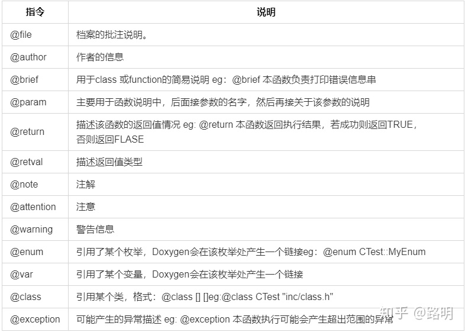

**所有命令：**

[Special Commands](https://www.doxygen.nl/manual/commands.html)


#### 主页注释

1. 在src目录添加 `mainpage.md` 文件
2. 打开 mainpage.md，首行的格式为`@mainpage xxx`

```
@mainpage 主页
以下markdown格式内容
# 简介
一些描述。
# Quick Start
一些使用说明。
- 条目1
- 条目2
```

1. 在配置文件中，`Expert-Input-USE_MDFILE_AS_MAINPAGE` 添加 `mainpage.md`

显示在主页的注释，并不针对特定文件，注释的内容可以使用MarkDown的语法。

```
/** @mainpage 主页
# 简介
一些描述。
# Quick Start
一些使用说明。
*/
```

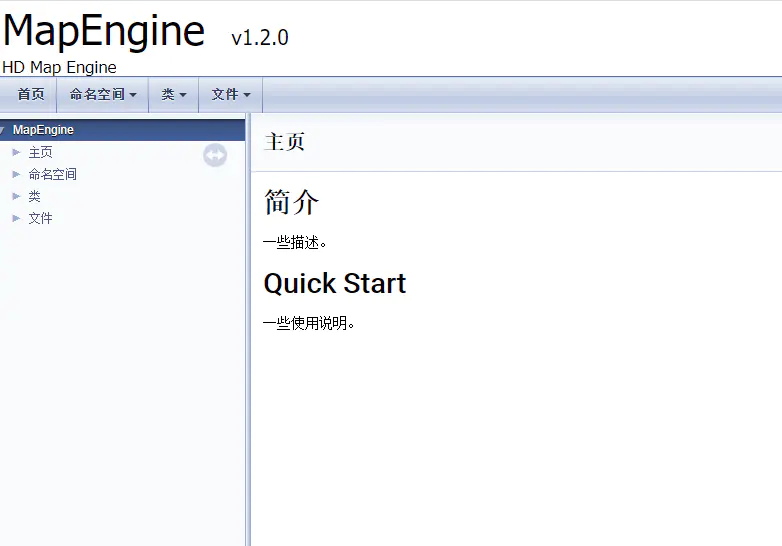

#### 文件注释

文件的开头必须有文件注释，否则该文件不会被识别？？    

在代码文件头部写上这段注释。可以标注一些文本名称、作者、邮件、版本、日期、介绍、以及版本详细记录。   

```
/**
 * @file sensor.c
 * @brief 简介 
 * @details 详细说明
 * @author 作者信息
 * @email Jones_Lee3@163.com
 * @version x.x
 * @date 2013-05-20
 * @note
 * **History**
 * Version|Auther|Date|Describe
 * ------|----|------|-------- 
 * vx.x|XXX| 2013-05-20 |Create File
 * @attention
 *  This file is part of OST. 
 * @par Copyright (c):
 *      XXX公司
 * @par History:        
 *   version: author, date, desc\n
 */
```


#### 简介与详情

1. @命令

	```
   /**
    * @brief 简介 
    * @details 详细说明
    */
   ```
	
2. One could use the \brief command with one of the above comment blocks. This command ends at the end of a paragraph, so the detailed description follows after an empty line.

   ```
    /*! \brief Brief description.
   *         Brief description continued.
   *
   *  详细描述Detailed description starts here.
   */
   ```

3. If [JAVADOC_AUTOBRIEF](https://www.doxygen.nl/manual/config.html#cfg_javadoc_autobrief) is set to `YES` in the configuration file, then using Javadoc style comment blocks will automatically start a brief description which ends at the first dot followed by a space or new line. Here is an example:

   ```
   /** Brief description which ends at this dot. 详细描述Details follow
    *  here.
    */
   ```

   The option has the same effect for multi-line special C++ comments:

   ```
   /// Brief description which ends at this dot. 详细描述Details follow
   /// here.
   ```

4. A third option is to use a special C++ style comment which does not span more than one line. Here are two examples:

   ```
   /// Brief description.
   /** Detailed description. */
   ```

   or

   ```
   //! Brief description.
   
   //! Detailed description 
   //! starts here.
   ```


#### 类注释

```text
/**
 * @brief Example class的简易说明
 * @detaills 本范例说明Example class。
 * 这是一个极为简单的范例。
 */
class Example {
private:
  /// 这是一个private的变数
  int var1; 
public:
  /// 这是一个public的变数成员
  int var2;
  int var3; ///< 这是另一个public的变数成员

  /**
   * @brief ExFunc1的简易说明
   * @details ExFunc1没有任何参数及传回值。
   */
  void Example::ExFunc1(void) {
    // empty funcion.
  }

  /**
   * @brief ExFunc2的简易说明
   *
   * ExFunc3()传回两个参数相加的值。
   *
   * @param a 用来相加的参数。
   * @param b[in] 用来相加的参数。
   * @param c[out] 用来传出参数。
   * @return 传回两个参数相加的结果。
   */
  int ExFunc2(int a, char b, int &res) {
    res = (a + b);
    return res;
  }
};
```


#### 函数注释

```
/**
 * @brief		send the message
 * @param 形参 参数说明
 * @return 返回说明
 * @retval 返回值说明
 * @note 注解
 * @attention 注意
 * @warning 警告
 * @exception 异常
 * @par Sample
 * @code
 *          char p[8] = {0};
 *          res_ res = 0;
 *          res = can_send_msg(CAN1,p);
 * @endcode
 */
int can_send_msg(int id, char *p);
```

> @param [in]  ID  输入本机的ID
>
> - [in] 表示是输入参数
> - [[out] 表示是输入参数
> - [inout] 表示输入输出参数

#### 枚举注释

```
/**
 * 枚举注释An enum.
 * More detailed enum description.
 */
enum TEnum {
  /// 前置说明enum value TVal1.
  TVal1,
  TVal2,     ///< 后置说明enum value TVal2.
  TVal3      /**< 后置说明enum value TVal3. */
} * enumPtr, ///< enum pointer. Details.
    enumVar; /**< enum variable. Details. */
```


#### 全局变量和宏

```
/// 全局变量
int g_GUID = 001;

static int s_xxx = 0; ///<  静态变量Description of static variable

/// 圆周率pi，前置注释
#define PI 3.14
 
#define EXAMPLE_OK  0   ///< 定义EXAMPLE_OK的宏为0，后置注释
```

todo 条件编译


#### 数据结构注释

```
/**
 * The brief description.
 * The detail description.
 */
typedef struct{
    int var1; ///<Description of the member variable
}XXXX;

或者
typedef struct box {
    double length; ///< The length of the box
    double width; ///< The width of the box
    double height; ///< The height of the box
};
```


#### 引用

```
@see 参见
@see 关于强制类型转换的目的类型参考 mypara 
```


```
@ref 引用链接
@ref CooperateThread.h
```

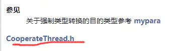


#### 模块注释


#### 示例

下面我们准备一组example.h 及example.cpp 来说明Doxygen 批注的使用方式：

```
/////////////////////// example.h ////////////////////////////
/**
 * @file 本范例的include档案。
 *
 * 这个档案只定义example这个class。
 *
 * @author garylee@localhost
 */

/// 圆周率pi，前置注释
#define PI 3.14
#define EXAMPLE_OK 0 ///< 定义EXAMPLE_OK的宏为0，后置注释

/**
 * 枚举注释An enum.
 * More detailed enum description.
 */
enum TEnum {
  /// 前置说明enum value TVal1.
  TVal1,
  TVal2,     ///< 后置说明enum value TVal2.
  TVal3      /**< 后置说明enum value TVal3. */
} * enumPtr, /**< enum pointer. Details. */
    enumVar; /**< enum variable. Details. */

/**
 * @brief Example class的简易说明
 * @detaills 本范例说明Example class。
 * 这是一个极为简单的范例。
 */
class Example {
private:
  int var1; ///< 这是一个private的变数
public:
  /// 这是一个public的变数成员
  int var2;
  int var3; ///< 这是另一个public的变数成员
  void ExFunc1(void);
  int ExFunc2(int a, char b);
  char *ExFunc3(char *c);
};


/////////////////////// example.cpp ////////////////////////////
/**
 * @file 本范例的程序代码档案。
 *
 * 这个档案用来定义example这个class的
 * member function。
 *
 * @author garylee@localhost
 */

/**
 * A constructor.
 * A more elaborate description of the constructor.
 */
Example::Example();

/**
 * A destructor.
 * A more elaborate description of the destructor.
 */
~Example::Example();

/**
 * @brief ExFunc1的简易说明
 * @details ExFunc1没有任何参数及传回值。
 */
void Example::ExFunc1(void) {
  // empty funcion.
}

/**
 * @brief ExFunc2的简易说明
 *
 * ExFunc3()传回两个参数相加的值。
 *
 * @param a 用来相加的参数。
 * @param b[in] 用来相加的参数。
 * @param c[out] 用来传出参数。
 * @return 传回两个参数相加的结果。
 */
int ExFunc2(int a, char b, int &res) {
  res = (a + b);
  return res;
}

/**
 * @brief ExFunc3的简易说明
 *
 * ExFunc3()只传回参数输入的指标。
 *
 * @param c 传进的字符指针。
 * @retval NULL 空字符串。
 * @retval !NULL 非空字符串。
 */
char *ExFunc2(char *c) { return c; }
```

**官方示例**

Here is the same piece of code as shown above, this time documented using the Javadoc style and [JAVADOC_AUTOBRIEF](https://www.doxygen.nl/manual/config.html#cfg_javadoc_autobrief) set to YES:

```
/**
 *  A test class. A more elaborate class description.
 */

class Javadoc_Test {
public:
  /**
   * An enum.
   * More detailed enum description.
   */

  enum TEnum {
    TVal1,     /**< enum value TVal1. */
    TVal2,     /**< enum value TVal2. */
    TVal3      /**< enum value TVal3. */
  } * enumPtr, /**< enum pointer. Details. */
      enumVar; /**< enum variable. Details. */

  /**
   * A constructor.
   * A more elaborate description of the constructor.
   */
  Javadoc_Test();

  /**
   * A destructor.
   * A more elaborate description of the destructor.
   */
  ~Javadoc_Test();

  /**
   * a normal member taking two arguments and returning an integer value.
   * @param a an integer argument.
   * @param s a constant character pointer.
   * @see Javadoc_Test()
   * @see ~Javadoc_Test()
   * @see testMeToo()
   * @see publicVar()
   * @return The test results
   */
  int testMe(int a, const char *s);

  /**
   * A pure virtual member.
   * @see testMe()
   * @param c1 the first argument.
   * @param c2 the second argument.
   */
  virtual void testMeToo(char c1, char c2) = 0;

  /**
   * a public variable.
   * Details.
   */
  int publicVar;

  /**
   * a function variable.
   * Details.
   */
  int (*handler)(int a, int b);
};
```

Click [here](https://www.doxygen.nl/manual/examples/jdstyle/html/class_javadoc___test.html) for the corresponding HTML documentation that is generated by doxygen.


 todo ...

```
  ///错误应答
  ///@param pRspInfo 返回用户响应信息的地址
  ///                响应信息结构：
  ///                struct CUstpFtdcRspInfoField {
  ///                  ///错误代码
  ///                  TUstpFtdcErrorIDType ErrorID;
  ///                  ///错误信息
  ///                  TUstpFtdcErrorMsgType ErrorMsg;
  ///                };
  ///@param nRequestID 返回用户操作请求的ID，该ID由用户在操作请求时指定
  ///@param bIsLast 指示该次返回是否为针对nRequestID的最后一次返回
  virtual void OnRspError(CUstpFtdcRspInfoField *pRspInfo, int nRequestID,
                          bool bIsLast){};
```


### ubuntu使用doxygen

1. 安装 doxygen   doxygen-gui

```
sudo apt-get install doxygen doxygen-gui doxygen-doc
```

2. 生成源代码注释文档

```
doxywizard
```

终端输入`doxywizard`出现图形界面，根据图形界面提示就可以了。

3. 学习doxygen

安装doxygen-doc后，会在`/usr/share/doc/doxygen`目录下有文档和例子.


### 生成源码文档

最简单的方式是通过 Doxywizard 打开之前保存的配置文件，修改项目名称，源文件目录，输出目录等，Run按照原来相同的配置直接生成源码文档。下面为初次手动配置。

此处主要参考：

[Doxygen使用教程](https://blog.csdn.net/zwl1584671413/article/details/82799483)

[Doxygen 配置使用指南](http://read.pudn.com/downloads151/doc/653112/Doxygen_Using_Manual.pdf)

Doxygen 产生文档可以分为三个步骤。

1. 在程序代码中加上符合Doxygen所定义批注格式。
2. 使用Doxywizard进行配置。
3. 使用Doxygen来产生批注文档。

#### Wizard

Doxywizard 主界面

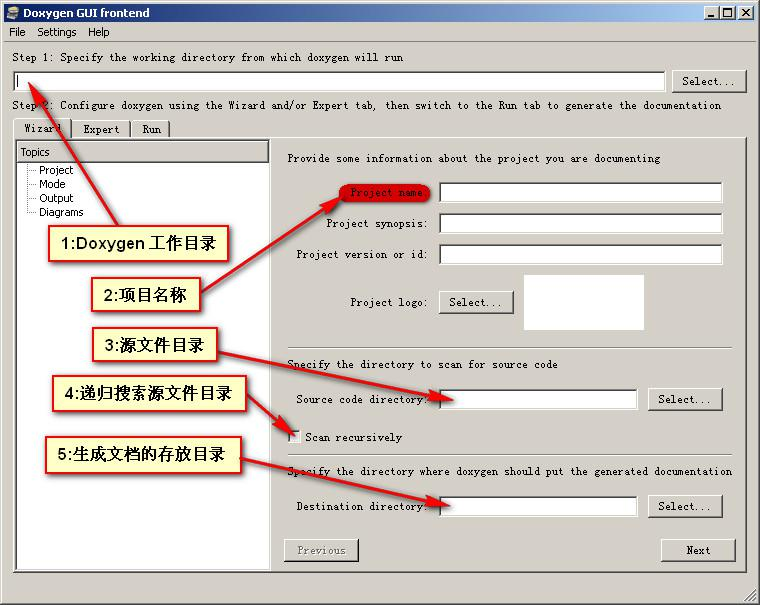

>  说明：
>
> 1. Doxygen 工作目录，就是用来存放配置文件的目录，也可空着。
> 2. 递归搜索源文件目录需要选上。
>

选项 wizard -->> Output Topics

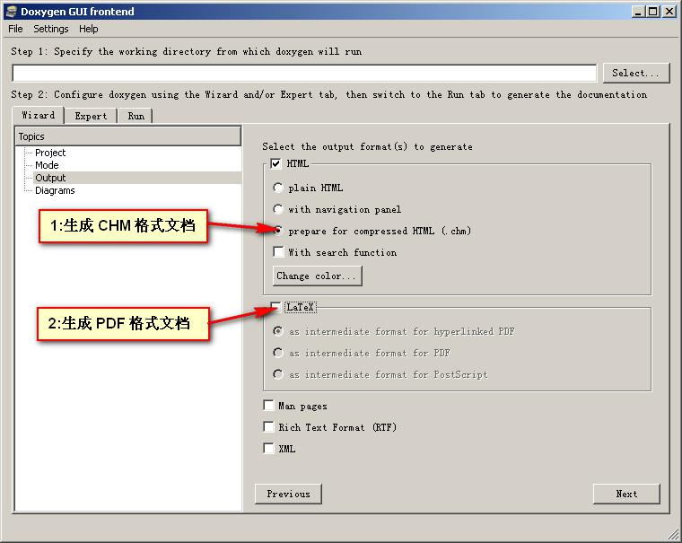

选项  wizard -->> Diagrams Topics

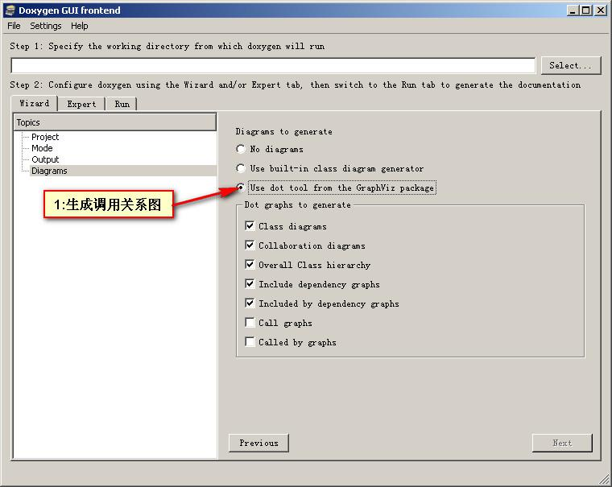

> 说明：
>
> 如果选择这个选项之前需要先安装了 Graphviz 工具包。

#### Expert

选项 expert -->> Project Topics

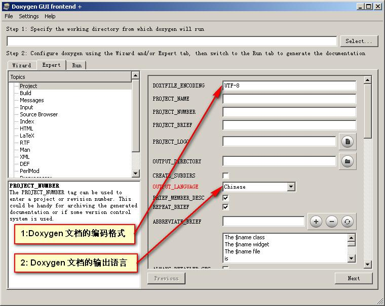

> 说明：
>
> 编码格式，UTF-8 是首选。如果需要显示中文则选择GB2312。
> TAB_SIZE 主要是帮助文件中代码的缩进尺寸，譬如@code和@endcode段中代码的排版，建议设置成4。OPTIMIZE_OUTPUT_FOR_C 这个选项选择后，生成文档的一些描述性名称会发生变化，主要是符合C习惯。如果是纯C代码，建议选择。
> SUBGROUPING这个选项选择后，输出将会按类型分组。

选项 expert -->> Build

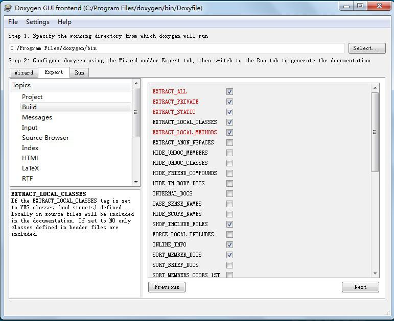

> 说明：
>
> Build页面，这个页面是生成帮助信息中比较关键的配置页面：
> EXTRACT_ALL 表示：输出所有的函数，但是private和static函数不属于其管制。
> EXTRACT_PRIVATE 表示：输出private函数。
> EXTRACT_STATIC 表示：输出static函数。同时还有几个EXTRACT，相应查看文档即可。
> HIDE_UNDOC_MEMBERS 表示：那些没有使用doxygen格式描述的文档（函数或类等）就不显示了。当然，如果EXTRACT_ALL被启用，那么这个标志其实是被忽略的。
> INTERNAL_DOCS 主要指：是否输出注解中的@internal部分。如果没有被启动，那么注解中所有的@internal部分都将在目标帮助中不可见。
> CASE_SENSE_NAMES 表示：是否关注大小写名称，注意，如果开启了，那么所有的名称都将被小写。对于C/C++这种字母相关的语言来说，建议永远不要开启。
> HIDE_SCOPE_NAMES 表示：域隐藏，建议永远不要开启。
> SHOW_INCLUDE_FILES 表示：是否显示包含文件，如果开启，帮助中会专门生成一个页面，里面包含所有包含文件的列表。
> INLINE_INFO ：如果开启，那么在帮助文档中，inline函数前面会有一个inline修饰词来标明。
> SORT_MEMBER_DOCS ：如果开启，那么在帮助文档列表显示的时候，函数名称会排序，否则按照解释的顺序显示。
> GENERATE_TODOLIST ：是否生成TODOLIST页面，如果开启，那么包含在@todo注解中的内容将会单独生成并显示在一个页面中，其他的GENERATE选项同。
> SHOW_USED_FILES ：是否在函数或类等的帮助中，最下面显示函数或类的来源文件。
> SHOW_FILES ：是否显示文件列表页面，如果开启，那么帮助中会存在一个一个文件列表索引页面。

选项 expert -->> Input Topics

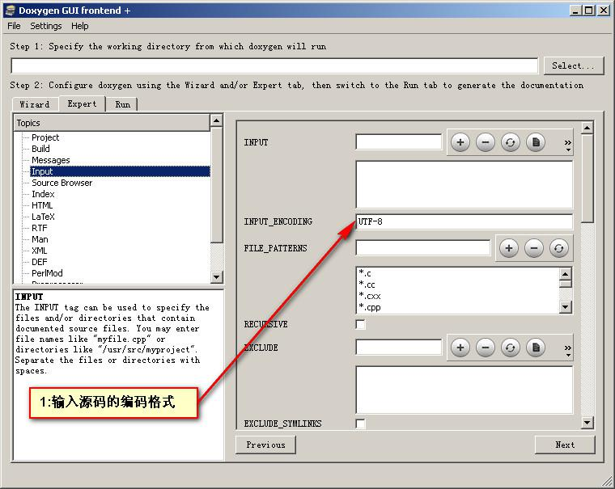

> 说明：
>
> 输入的源文件的编码，要与源文件的编码格式相同。如果源文件不是UTF-8编码最好转一下。

选项 expert -->> HTML Topics

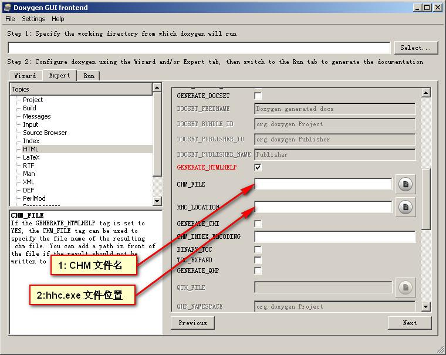

> 说明：
>
> 1. 如果需要生成chm文件才需配置。
> 2. CHM_FILE文件名需要加上后缀（xx.chm）。
> 3. 如果在 Wizard 的 Output Topics 中选择了 prepare for compressed HTML (.chm)选项，此处就会要求选择 hhc.exe 程序的位置。在 windows help workshop 安装目录下可以找到 hhc.exe。
> 4. 为了解决DoxyGen生成的CHM文件的左边树目录的中文变成了乱码，CHM_INDEX_ENCODING中输入GB2312即可。
> 5. GENERATE_CHI 表示索引文件是否单独输出，建议关闭。否则每次生成两个文件，比较麻烦。
> 6. TOC_EXPAND 表示是否在索引中列举成员名称以及分组（譬如函数，枚举）名称。

#### Run

选项 Run -->> Run doxygen

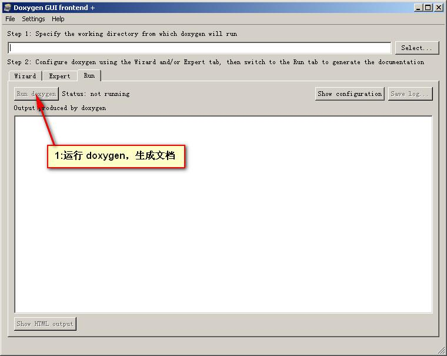

> 说明：
>
> 点击 Run doxygen 按钮，Doxygen 就会从源代码中抓取符合规范的注释生成你定制的格式的文档。如果没有报错的话。


### reference

[doxygen官方文档](https://www.doxygen.nl/manual/docblocks.html#docexamples)

[Doxygen快速入门](https://zhuanlan.zhihu.com/p/100223113)

[Doxygen使用教程（个人总结）](https://blog.csdn.net/zwl1584671413/article/details/82799483)

[Doxygen文档生成工具](https://www.jianshu.com/p/bf5afbbe183b)

[Doxygen 配置使用指南](http://read.pudn.com/downloads151/doc/653112/Doxygen_Using_Manual.pdf)

